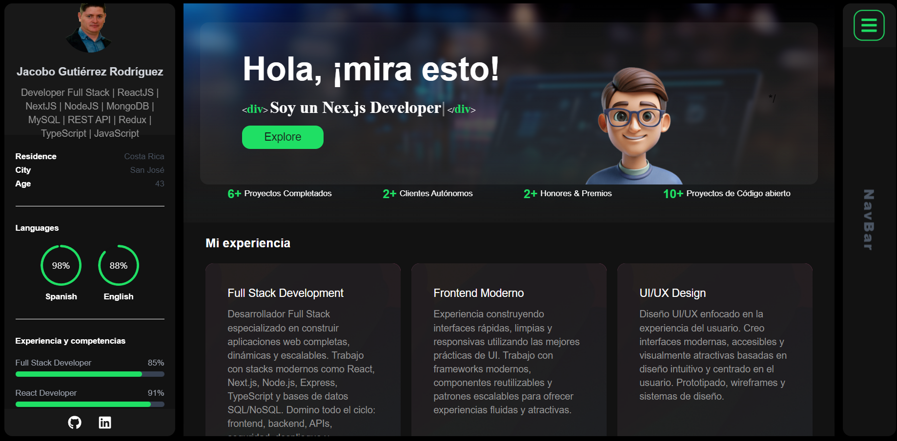

<div align="center">
  
  
  
  
  [](https://twitter.com/intent/follow?screen_name=iosamajavaid)

  <br />
  <br />
  
  

  <h2 align="center">Jacobo Gutiérrez - Personal portfolio</h2>

Este sitio web es un portafolio personal totalmente adaptable., <br />Adaptable a todos los dispositivos, creado con Nextjs, TailwindCSS únicamente.

<a href="https://osamajavaid.vercel.app/"><strong>➥ Demostración en vivo</strong></a>

</div>

<br />

### Capturas de pantalla de demostración



### Prerrequisitos

Antes de comenzar, asegúrese de cumplir los siguientes requisitos:

- [Git](https://git-scm.com/downloads "Descargar Git") Debe estar instalado en su sistema operativo.

### Ejecutar localmente

Para ejecutar **portfolio** localmente, ejecute este comando en su bash git:

Linux and macOS:

```bash
sudo git clone https://github.com/Jacobo1k982/p-developer.git
```

Windows:

```bash
git clone https://github.com/Jacobo1k982/p-developer.git
```

### Licencia

Este proyecto es de **uso gratuito** y no contiene ninguna licencia.
